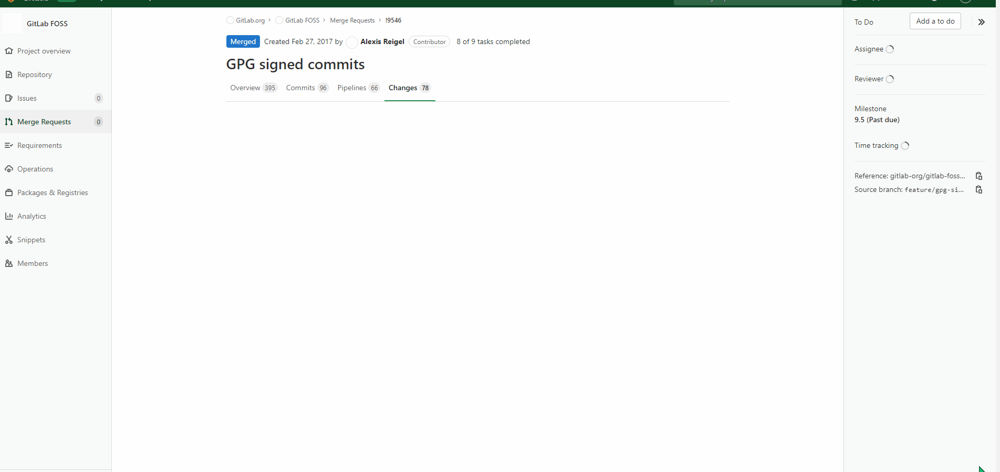

# Merge Request Tools

Chrome plugin to help with Gitlab merge requests. Currently has 2 features: 

* Filtering MR files with wildcard patterns (help improve responsiveness for massive MRs)
* Checkboxes to filter out renamed / deleted files since these don't require much review

Filtered out files are set to "display: none", both in the diffs and the tree view.
## Known limitations

* The code is a total hack-job and makes a lot of unsafe assumptions
* When a merge request is still loading files, the filters are not applied to newly added files. Just click apply again after it's finished loading.
* It totally craps out if you collapse any of the folders in the file tree view and then filter
* If you have filters applied and then open the tree view, you will need to apply the filters again for the tree view to be filtered
## GIF example

